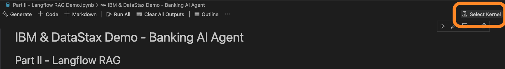
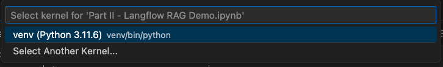
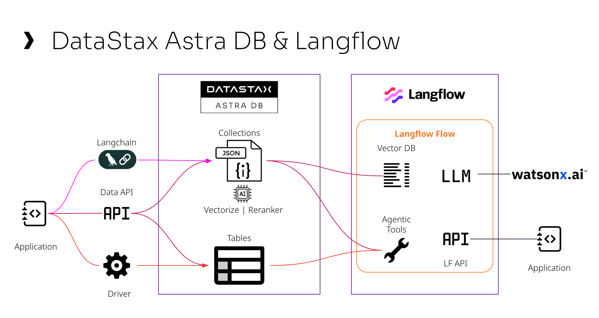

# IBM & DataStax Demo - Banking AI Agent

## Before start

What you will need:

- Install dependencies (Preparing for the demo)
- An account on DataStax Astra (Part I)
- A API Key from Watsonx.AI or OpenAI

# Preparing for the demo:

Create a virtual environment:

```
python -m venv venv
```

Activate the environment

On Mac/Unix:
```
source venv/bin/activate
```

On Windows:
```
venv\Scripts\activate
```

On the virtual environment, install the libraries

```
pip install -r requirements.txt
```

Register jupyter on the virtual environment
```
python -m ipykernel install --user --name=venv --display-name "Python (venv)"
```

### VS Code

If you are running the notebooks on VS Code, select your virtual environment for the notebook:



Then select "venv"



# Astra DB, Langflow and Watsonx.AI



# Part I - Astra DB Setup, Vector Search, Rerankers and Lexical Search

Run the Jupyter notebook: [Part_I_AstraDB_Demo.ipynb](Part_I_AstraDB_Demo.ipynb)

Goals:

- Create an account on DataStax Astra.
- Create a Database
- Create a collection with Vectorize (NVIDIA model)
- Load the Astra collection with a document

# Part II - Langflow RAG

Run the Jupyter notebook: [Part II - Langflow RAG Demo.ipynb](Part_II_Langflow_RAG_Demo.ipynb)
You can import the file [Langflow RAG with IBM.json](<Langflow RAG with IBM.json>) on Langflow for reference.

Goals:

- Create a Langflow RAG flow and connect to Astra
- Connect the flow to the WatsonX.AI Models
- Run the Flow through the Langflow API

# Part III - Agents and NoSQL

Run the Jupyter notebook: [Part_III_Astra_NoSQL_AI.ipynb](Part_III_Astra_NoSQL_AI.ipynb)
You can import the file [Langflow RAG with IBM.json](<Part_III - Langflow Agent with NoSQL data from Astra DB.json>) on Langflow for reference.

- Create a CQL table to store banking transactions
- Load sample data
- Create an Banking Agent Flow on Langflow.
- Connect the Astra DB Tools to the agent.
- Run the Flow through the Langflow API


